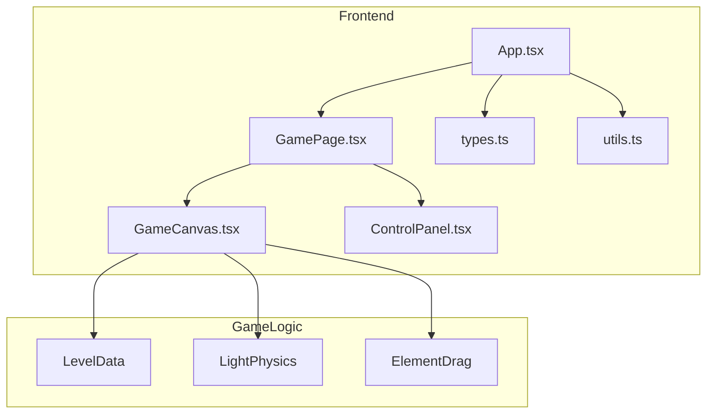

## 1. Architecture Design


## 2. Technology Description
- **Frontend**: React@18 + TypeScript + tailwindcss@3 + vite
- **Initialization Tool**: vite-init
- **Backend**: None (纯前端项目)
- **Database**: None (关卡数据硬编码)

## 3. Route Definitions
| Route | Purpose |
|-------|---------|
| / | 游戏主页面 |

## 4. Data Model

### 4.1 Type Definitions
```typescript
// 光学元件类型
type ElementType = 'lightSource' | 'mirror' | 'prism' | 'target';

// 光学元件接口
interface OpticalElement {
  id: string;
  type: ElementType;
  x: number;
  y: number;
  angle: number; // 旋转角度，以度为单位
  width: number;
  height: number;
  draggable: boolean;
}

// 关卡接口
interface Level {
  id: number;
  name: string;
  elements: OpticalElement[];
}

// 光线线段
interface LightRay {
  startX: number;
  startY: number;
  endX: number;
  endY: number;
}
```

### 4.2 Level Data Example
```typescript
const levels: Level[] = [
  {
    id: 1,
    name: "入门关卡",
    elements: [
      { id: 'light1', type: 'lightSource', x: 100, y: 300, angle: 0, width: 40, height: 40, draggable: false },
      { id: 'mirror1', type: 'mirror', x: 300, y: 300, angle: 45, width: 60, height: 10, draggable: true },
      { id: 'target1', type: 'target', x: 300, y: 100, angle: 0, width: 50, height: 50, draggable: false },
    ]
  }
];
```

## 5. Core Components
| Component | Responsibility |
|-----------|----------------|
| GameCanvas | 渲染游戏场景，处理光线物理计算，处理元件拖拽 |
| ControlPanel | 提供关卡控制、重置、提示等功能 |
| GamePage | 主页面容器，整合所有组件 |

## 6. Key Functions
| Function | Purpose |
|----------|---------|
| calculateLightPath | 计算光线传播路径，处理反射和折射 |
| handleDrag | 处理光学元件的拖拽交互 |
| checkWinCondition | 检查光线是否照射到所有目标 |
| drawElements | 在Canvas上绘制所有光学元件 |

