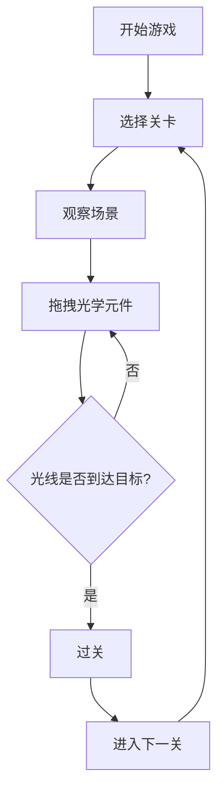

## 1. Product Overview
光学解锁游戏是一款基于物理光学折射原理的益智解谜游戏，玩家需要通过移动反射镜和棱镜来引导光线到达目标区域。
- 目标用户为喜欢解谜游戏的玩家，提供寓教于乐的游戏体验
- 核心价值在于将光学知识与游戏玩法结合，让玩家在游戏中学习

## 2. Core Features

### 2.1 Feature Module
1. **游戏页面**：游戏画布、关卡选择、控制按钮
2. **关卡系统**：多个精心设计的关卡，难度逐渐递增
3. **光学元件**：反射镜、棱镜、光源、目标接收器

### 2.3 Page Details
| Page Name | Module Name | Feature description |
|-----------|-------------|---------------------|
| 游戏页面 | 游戏画布 | 使用Canvas绘制游戏场景，支持拖拽元件 |
| 游戏页面 | 关卡选择 | 显示当前关卡，提供下一关/上一关功能 |
| 游戏页面 | 控制按钮 | 重置关卡、提示功能 |

## 3. Core Process
玩家进入游戏 → 选择关卡 → 观察场景布局 → 拖拽光学元件调整位置 → 光线成功照射到目标 → 过关进入下一关

## 4. User Interface Design
### 4.1 Design Style
- **主色调**：深色背景（#1a1a2e）搭配亮黄色光线（#ffd700）和蓝色目标（#00bfff）
- **按钮风格**：圆角按钮，悬停有发光效果
- **字体**：使用Geist Sans，现代简约风格
- **布局**：居中布局，游戏画布为主，控制栏在底部
- **图标**：使用lucide-react图标库，简洁线性风格

### 4.2 Page Design Overview
| Page Name | Module Name | UI Elements |
|-----------|-------------|-------------|
| 游戏页面 | 游戏画布 | Canvas渲染，深色背景，光线动画效果 |
| 游戏页面 | 关卡信息 | 显示当前关卡编号和关卡名称 |
| 游戏页面 | 控制栏 | 重置按钮、关卡选择按钮、提示按钮 |

### 4.3 Responsiveness
- 桌面端优先设计，适配不同屏幕尺寸
- 移动端支持触摸操作
- 游戏画布响应式缩放

